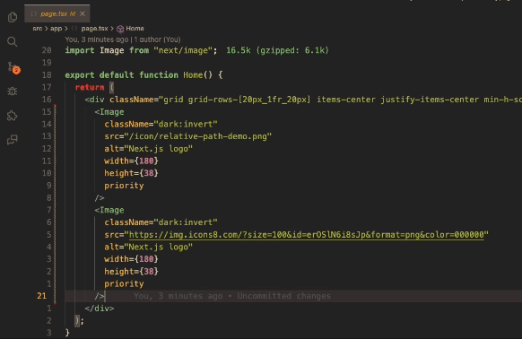

# Nextjs Image Quickview

This extension allows you to quickly view images in your Next.js project.

## Features

Nextjs Image Quickview allows you to quickly view images in your Nextjs project by hovering over the "src" attribute directly or hovering over the Image tag name of the Nextjs Image component.

- Works with Nextjs Image component that use relative paths or https urls.

## Usage 

Hover over the "src" attribute directly or hover over the Image tag name of the Nextjs Image component.

